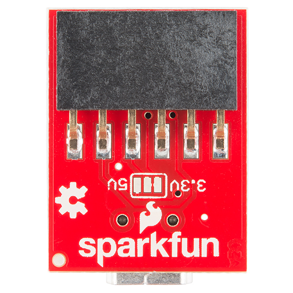

## Getting Started with the ESP8266 Thing by SparkFun

* 1x [SparkFun ESP8266 Thing (WRL-13231)][SFE Thing]
* 1x [SparkFun FTDI Basic Breakout - 3.3V (DEV-09873)][SparkFun FTDI 3.3V]
* 1x 1000uF electrolytic decoupling-capacitor, polarised 16Vdc.

### Serial Debugging &mdash; That pesky DTR line

The [ESP8266 Thing Hookup Guide][ESP8266 Thing Hookup Guide] details functionality of the [DTR pin on-board the Thing][ESP8266 Thing Hookup Guide Hardware Overview] as

> Performs auto-reset, and puts the ESP8266 into bootloader mode. Connects through a capacitor to RESET, and a buffer to the ESP8266's GPIO0.

The ESP8266 is placed into bootloader mode by holding GPIO0 low and cycling power; to resume running the current program GPIO0 needs to be floating or tied to Vcc (3.3vdc).  A further note cautions,

> Of these jumpers, the DTR one is the most commonly modified. The DTR output of the FTDI Basic is used for two purposes: to reset the ESP8266 and pull GPIO0 low (putting the chip in bootloader mode). Keeping this jumper closed enables programming, but makes debugging via the Serial Monitor difficult, as the board will reset into bootloader mode whenever the terminal opens.

The hookup guide further [details how GPIO0 and the DTR line are used][Serial Debugging] to (along with RST) to auto-reboot the ESP8266 post uploading of a sketch

> GPIO0 – while perfectly capable as a digital I/O – serves a secondary purpose as a bootload/run-mode controller. When the ESP8266 boots up, it looks at GPIO0’s value to either enter the bootloader or start running the current program:

> To make it easy to program the ESP8266, we’ve tied GPIO0 to DTR (along with RST). When your programmer begins to upload a sketch, it’ll pull DTR low, in turn setting GPIO0 low and making the ESP8266 enter bootloader mode.

> Unfortunately, when you open a serial terminal, DTR usually goes low again. So every time you open the Arduino serial monitor, it’ll cause the ESP8266 to enter bootloader mode, instead of run-program mode. If you open up the serial monitor, and all you see is a line of gibberish, you’ve probably booted the ESP8266 into bootloader mode.

SparkFun also [propose a solution to allowing serial debugging][Serial Debugging] with the [FTDI Basic 3.3vdc][SparkFun FTDI 3.3V] + [ESP8266 Thing][SFE Thing],

> We’ve added the DTR jumper on the bottom of the board. You can cut the trace on the back and install a 2-pin male header combined with a 2-pin jumper. If the jumper is present, the board will be able to be programmed. Removing the jumper will enable serial terminal mode.

Rather than cutting traces, I took the approach of desoldering the DTR pin from the SMD 6-pin header at the bottom of the [FTDI Basic 3.3vdc][SparkFun FTDI 3.3V] board.



Having done so, I am able to tie GPIO0 to ground and cycle power &mdash; whenever I need to upload a new sketch to the ESP8266.

## Upgrading Onboard Flash Memory

The following details are based on this guide for upgrading [ESP-03 Flash Memory To 128 Mbit][ESP-03 Upgrade Flash Memory To 128 Mbit].  Here are a couple options, noting that the [Adesto chip][Adesto AT25SF321 Datasheet] is a direct replacement for the chips installed on the [SparkFun Thing WRL-13231][SFE Thing] &mdash;

* [Adesto AT25SF321][Adesto AT25SF321 Datasheet]: 32-Mbit, 2.5V Minimum SPI Serial Flash Memory with Dual-I/O and Quad-IO Support

* [Winbond 25Q128FV][Winbond 25Q128FV Datasheet]: 128M-bit Serial Flash Memory with uniform 4KB sectors and Dual/Quad SPI and QPI

I was able to locate the [Winbond 25Q128FV][AliExpress Winbond 25Q128FV] for sale on AliExpress, and thankfully offering world-wide delivery.

### Building NodeMCU with Vagrant

Vagrant can be used to quickly build the NodeMCU binary. You will need
to modify the `Vagrantfile` to ensure the synced folder `/iot/nodemcu-firmware_fork` within the Virtualbox VM points to your correct local-folder.

Note that [bsodmike/nodemcu-firmware](https://github.com/bsodmike/nodemcu-firmware) incorporates a [patch for the larger EEPROM size](https://github.com/bsodmike/nodemcu-firmware/commit/326c88bb4dd29271456725d62a393705e2cd27a7) in the `bsodmike-build` branch, which I plan to maintain against the `master` branch of [nodemcu/nodemcu-firmware](https://github.com/nodemcu/nodemcu-firmware).

```
$ git clone https://github.com/bsodmike/nodemcu-firmware
$ git checkout bsodmike-build
$ cd nodemcu-firmware

# Modify `app/include/user_modules.h` to select modules you wish included in your build.
# Ref: https://github.com/nodemcu/nodemcu-firmware/blob/master/app/include/user_modules.h

# Start Vagrant - this will take a while.
$ vagrant up
$ vagrant ssh

# You will now be SSH'd into the Virtualbox VM
vagrant@vagrant-ubuntu-vivid-64:~$ service docker start
vagrant@vagrant-ubuntu-vivid-64:~$ cd /iot/nodemcu-firmware_fork

# Use of the Docker Mount volume (-v) flag:
# https://docs.docker.com/engine/reference/commandline/run/#/mount-volume-v-read-only
#
# This sets the current directory, where you cloned the `bsodmike/nodemcu-firmware` repo above, at `/opt/nodemcu-firmware` within the container.
vagrant@vagrant-ubuntu-vivid-64:~$ docker run --rm -ti -e "FLOAT_ONLY=1" -v `pwd`:/opt/nodemcu-firmware marcelstoer/nodemcu-build
```

You will find the compiled binary in `nodemcu-firmware/bin` which is
ready to be flashed onto a new EEPROM chip.

### Flashing NodeMCU onto the new EEPROM chip.

```
# Put ESP8266 into Flash Mode:
# http://nodemcu.readthedocs.io/en/master/en/flash/#putting-device-into-flash-mode
#
# Flash your ESP8266:
# http://nodemcu.readthedocs.io/en/master/en/flash/#esptool
#
$ esptool.py --port <USB-port-with-ESP8266> write_flash 0x00000 <NodeMCU-firmware-directory>/bin/nodemcu_[integer|float]_<Git-branch>.bin
```

----------
[SFE Thing]: https://www.sparkfun.com/products/13231 "Thing WRL-13231"
[SparkFun FTDI 3.3V]: https://www.sparkfun.com/products/9873 "FTDI 3.3V"

[SFE Thing Github]: https://github.com/sparkfun/ESP8266_Thing "SparkFun ESP8266 Thing"
[ESP8266 Thing Hookup Guide]: https://learn.sparkfun.com/tutorials/esp8266-thing-hookup-guide/introduction "ESP8266 Thing Hookup Guide"
[ESP8266 Thing Hookup Guide Hardware Overview]: https://learn.sparkfun.com/tutorials/esp8266-thing-hookup-guide/hardware-overview "ESP8266 Thing Hookup Guide - Hardware Overview"

[Serial Debugging]: https://learn.sparkfun.com/tutorials/esp8266-thing-hookup-guide/using-the-arduino-addon#serial-dtr "Using Serial Monitor"

[AliExpress Winbond 25Q128FV]: http://www.aliexpress.com/item/25Q128FV/32675826288.html?spm=2114.13010208.99999999.267.TgW1G0 "AliExpress Winbond 25Q128FV"
[Winbond 25Q128FV Datasheet]: http://www.winbond.com/hq/product/code-storage-flash-memory/serial-nor-flash/?__locale=en&partNo=W25Q128FV "Winbond 25Q128FV Datasheet"
[Adesto AT25SF321 Datasheet]: http://www.adestotech.com/wp-content/uploads/DS-AT25SF321_047.pdf "Adesto AT25SF321 Datasheet"
[ESP-03 Upgrade Flash Memory To 128 Mbit]: http://www.instructables.com/id/ESP-03-Upgrade-Flash-Memory-to-128-M-Bit/?ALLSTEPS "ESP-03 Upgrade Flash Memory To 128 Mbit"
